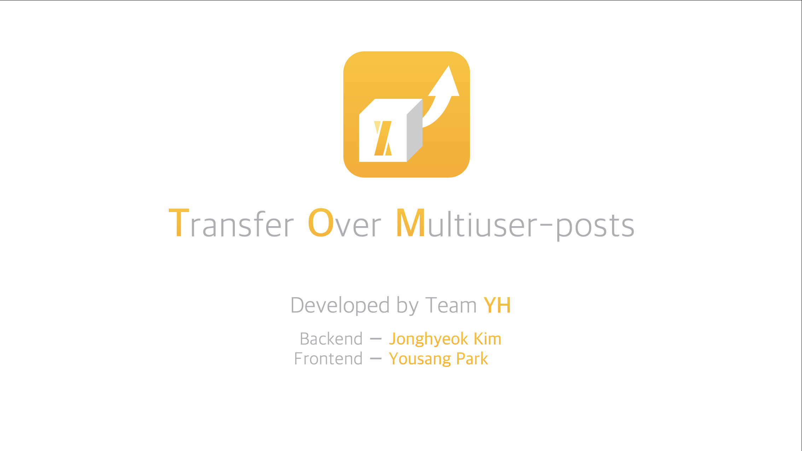

# Project TOM (Transfer Over Multiuser-posts)

 

## Introduction

Our team members ーKim and Parkー have built our own GitHub Page blogs. And thanks to [docu-notion](https://github.com/sillsdev/docu-notion), we could write posts on any devices via Notion. But still, we should use only laptop and type some commands on terminal to upload posts. We think this process was a little bit annoying. So we decided to develop an mobile application that can do this with just a few touches.

 

## Features

 

